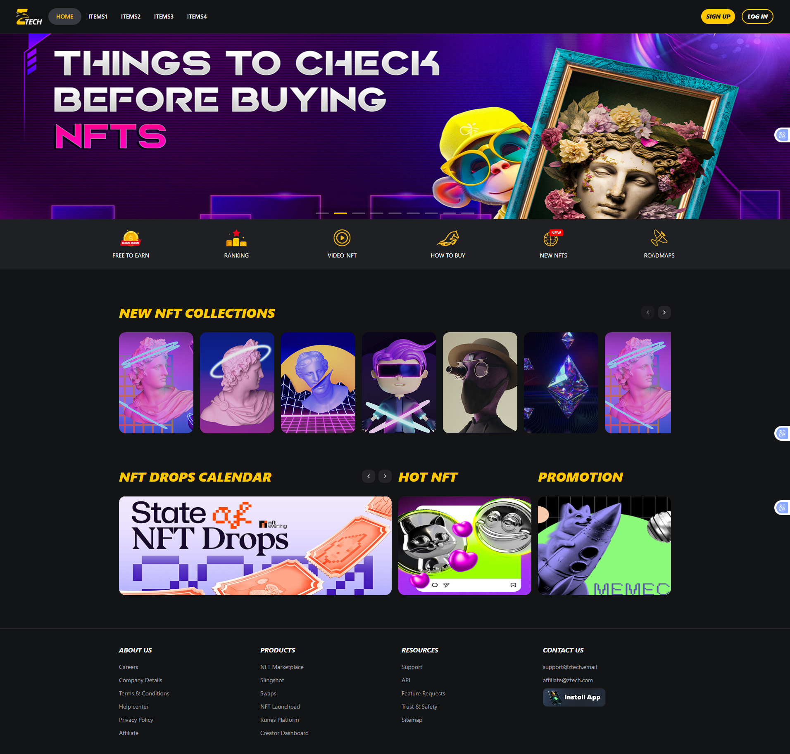
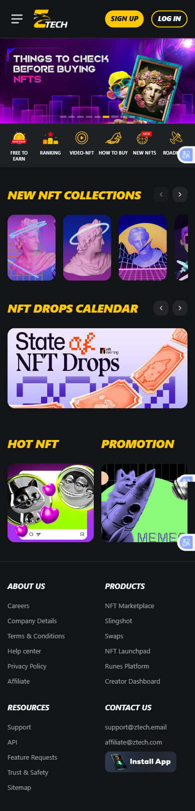
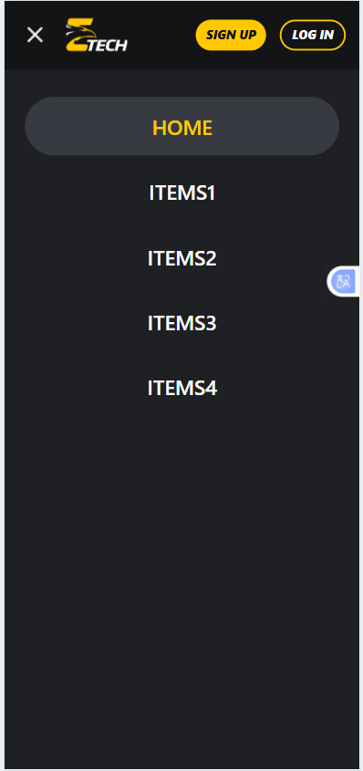

# e-tech-neveltech

Đây là một dự án giao diện người dùng được xây dựng bằng Vite, React, và Shadcn/ui.

## ✨ Tính năng

*   Giao diện người dùng hiện đại và đáp ứng (responsive).
*   Được xây dựng với các thành phần giao diện người dùng có thể tái sử dụng từ `shadcn/ui`.
*   Tích hợp định tuyến phía máy khách với `React Router`.
*   Sử dụng `Tailwind CSS` để tạo kiểu một cách tiện ích.

## 🚀 Công nghệ sử dụng

*   **Framework**: [React](https://reactjs.org/)
*   **Build Tool**: [Vite](https://vitejs.dev/)
*   **Ngôn ngữ**: [TypeScript](https://www.typescriptlang.org/)
*   **Styling**: [Tailwind CSS](https://tailwindcss.com/)

## 📸 Ảnh chụp màn hình

### Desktop



### Mobile




## 📦 Bắt đầu

Làm theo các hướng dẫn sau để cài đặt và chạy dự án trên máy của bạn.

### Điều kiện tiên quyết

*   [Node.js](https://nodejs.org/en/) (phiên bản 18.x trở lên)
*   [npm](https://www.npmjs.com/) hoặc [yarn](https://yarnpkg.com/)

### Cài đặt

1.  Clone a repository:
    ```bash
    git clone https://github.com/haudn1997/e-tech-neveltech
    cd e-tech-neveltech
    ```

2.  Cài đặt các dependency:
    ```bash
    npm install
    ```
    hoặc
    ```bash
    yarn install
    ```

### Chạy dự án

Để khởi động máy chủ phát triển, chạy lệnh sau:

```bash
npm run dev
```

Mở [http://localhost:8080](http://localhost:8080) (hoặc một cổng khác nếu 8080 đã được sử dụng) trong trình duyệt của bạn để xem ứng dụng.